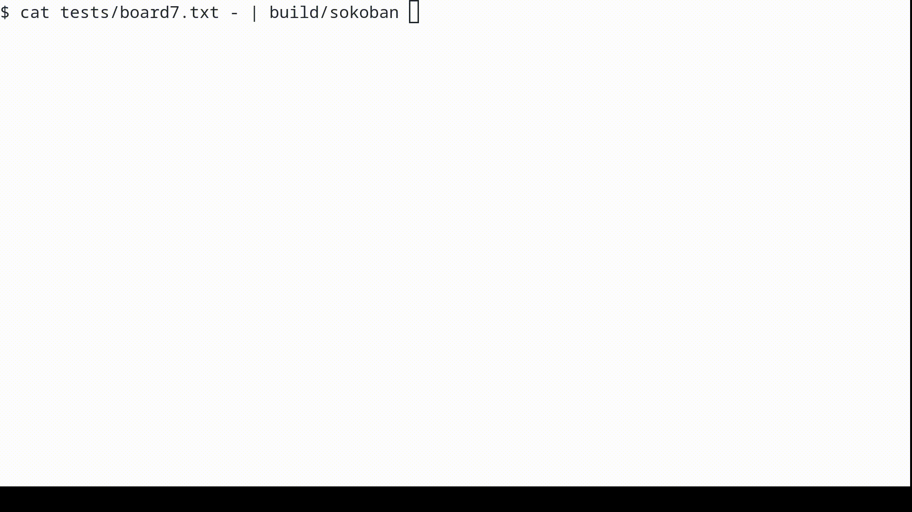

# cokoban

Sokoban game which can be played in the terminal.

Project works for a Linux system with a working gcc compiler, to run tests you
should have [valgrind](https://valgrind.org/). A [Makefile](Makefile) with a
default compilation command is supplied. It also has phony targets clean and
test. Running `make` produces a `build/sokoban` binary which operates on
standard input and standard output.

Here's how you can run the program from the project's root directory while using
one of the example boards from the [tests](tests) directory.

```bash
cat tests/board7.txt - | build/sokoban
```

## Demo



## Introduction

[Sokoban](https://en.wikipedia.org/wiki/Sokoban) is a single player puzzle game
played on a two-dimensional board with square fields. Some board fields are
empty, on others there are walls or boxes. A certain number of fields is marked
as target fields. The target field can be an empty field or a field where a box
is. On one of the fields of the board there is a character controlled by the
player. It can move to fields adjacent to the current one, either vertically or
horizontally. In particular, adjacent fields to a field in line L, column C are:

- line L - 1, column C,
- line L + 1, column C,
- line L, column C - 1,
- line L, column C + 1.

The character can move to a field if it is empty or there is a box on it that
the character can push.

Pushing the box is possible if directly behind it, in the direction of the
movement of the character, there is an empty field. It is not possible to move
the character or push the box outside the board. It is not possible to push more
than one box at once.

The goal of the game is to place the crates on the target fields.

Unlike typical Sokoban implementations, the user does not have to give movements
moving the character through empty fields. The program itself determines how to
bring the character to the field from which it will be possible to push the box
in the indicated direction.

## Input format

The program's valid input is a description of the initial state of the board, an
empty line, and a sequence of instructions on separate lines, ending with a line
that starts with a dot `.`.

The program ignores the input content after the data-ending dot.

The description of the board consists of non-empty lines in which there are one
character representations of the fields:

- `-` - an empty non-target field,
- `+` - an empty target field,
- `#` - a wall,
- `@` - a non-target field with the character on it,
- `*` - a target field with the character on it,
- `[a .. z](small letter)` - a non-target field with a box with the given name
on it,
- `[A .. Z](large letter)` - a target field with a box with the given name on it,
name corresponds to the lowercase version of it.

Correct description of the board includes exactly one character, and each letter
of the Latin alphabet occurs at most once, meaning there can't be 2 boxes with
the same name.

The program recognizes the following commands:

- `[a .. z][2 | 4 | 6 | 8]` (a small letter after which there is a number 2, 4,
6 or 8) - pushing a box with the name, which is the first character of the
command, in the direction specified by the second character. The numbers mean,
inspired from the numpad:
  - 2 - down,
  - 8 - up,
  - 4 - left,
  - 6 - right.\
For the command to succeed there should exist a path of empty fields from the
character to the field from which the push should be made and the box should be
pushable in the specified direction. If there is no such path or the chest
cannot be pushed, the state of the board does not change.
- `0` - undo the last push. If there are no more pushes to be undone, the state
of the board does not change.

## Output format

Program prints the initial board state to standard output and then proceeds to
output the state after each command is executed.
